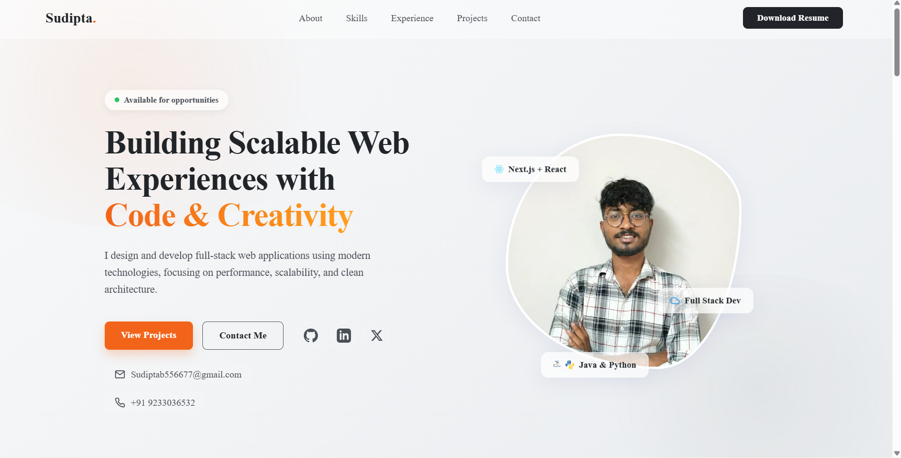

# Sudipta Baidya - Personal Portfolio

Welcome to the source code for my personal portfolio! This is a modern, responsive web application designed to showcase my skills, experience, and projects as a Full-Stack developer currently seeking internship and freelance opportunities.



## 🚀 Key Features

*   **Modern Aesthetics:** Clean, vibrant glassmorphism design with a tailored dark mode user experience.
*   **Fully Responsive:** Developed meticulously for seamless viewing across mobile, tablet, and desktop environments.
*   **Performance First:** Built utilizing the Next.js App Router for server-side optimizations, quick loading times, and SEO enhancements.
*   **Contact Functional:** Includes a live Web3Forms integration so recruiters and clients can email me directly from the portfolio without a backend server.
*   **Downloadable Resources:** A single-click functional button to download my latest professional resume.
*   **Organized Sections:** Dedicated timeline tracking for Work Experience, Skills overview, and Project showcases (like Cineverse).

## 🛠️ Tech Stack

This project was built using the following core technologies:
*   **Framework:** [Next.js (App Router)](https://nextjs.org/)
*   **Library:** React 19
*   **Styling:** Custom Vanilla CSS Modules (Flexbox/Grid/Variables)
*   **Language:** TypeScript
*   **Forms:** [Web3Forms API](https://web3forms.com/)

## 💻 Getting Started Locally

If you'd like to run this application on your local machine to review the code or see how it functions:

1.  **Clone the Repository**
    ```bash
    git clone https://github.com/SudiptaBaidya/PortFolio.git
    cd PortFolio/my-portfolio
    ```

2.  **Install Dependencies**
    ```bash
    npm install
    ```

3.  **Run Development Server**
    ```bash
    npm run dev
    ```

4.  **View Site**
    Open [http://localhost:3000](http://localhost:3000) in your browser.

> [!NOTE] 
> To test the Contact Form locally, you must provide your own `Web3Forms` Access Key inside of `src/components/Contact.tsx`. 

## 📬 Let's Connect!
*   **Email:** [Sudiptab556677@gmail.com](mailto:Sudiptab556677@gmail.com)
*   **LinkedIn:** [Sudipta Baidya](https://www.linkedin.com/in/sudipta-baidya-216608332/)
*   **GitHub:** [SudiptaBaidya](https://github.com/SudiptaBaidya)
*   **X (Twitter):** [@Sudipta_Imao](https://x.com/Sudipta_Imao)
